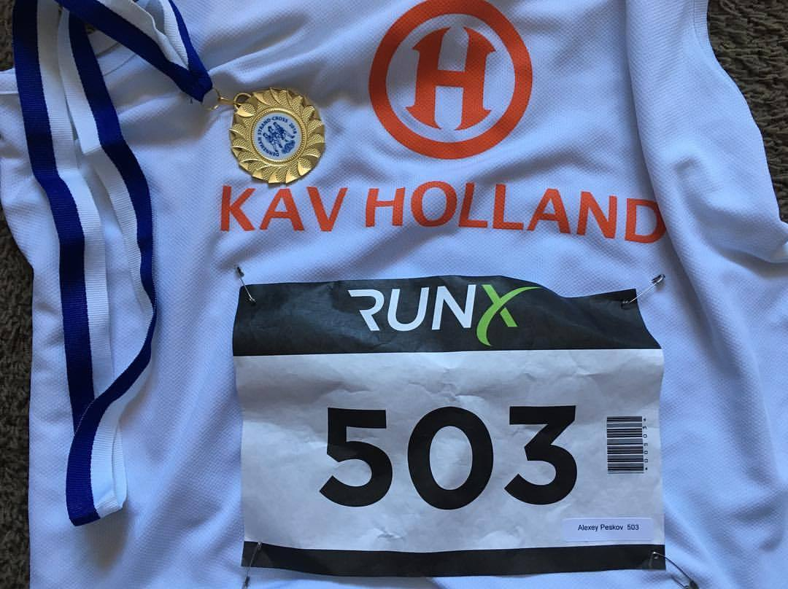
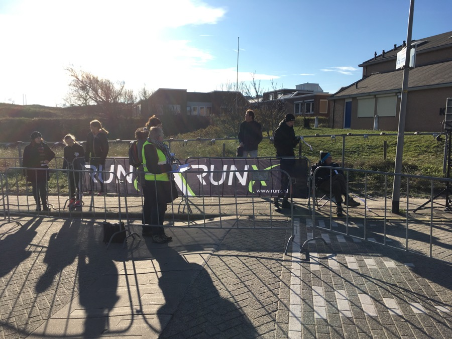
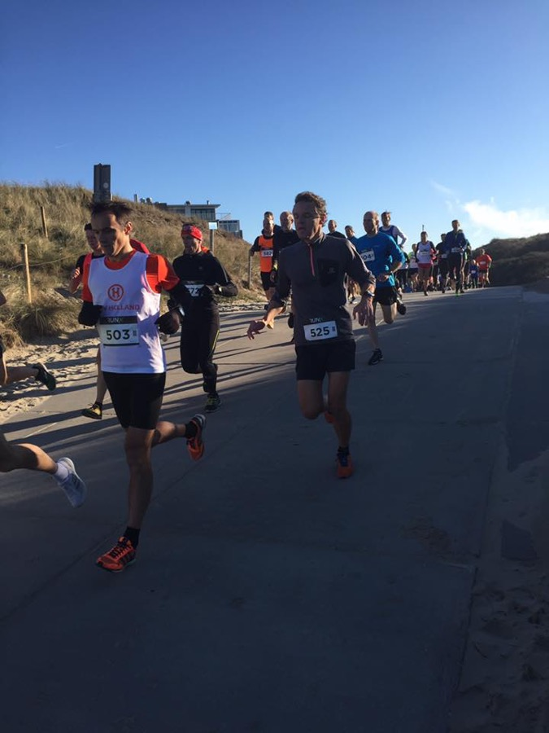
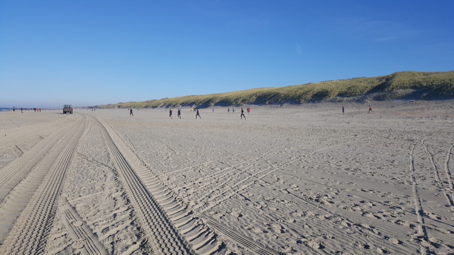
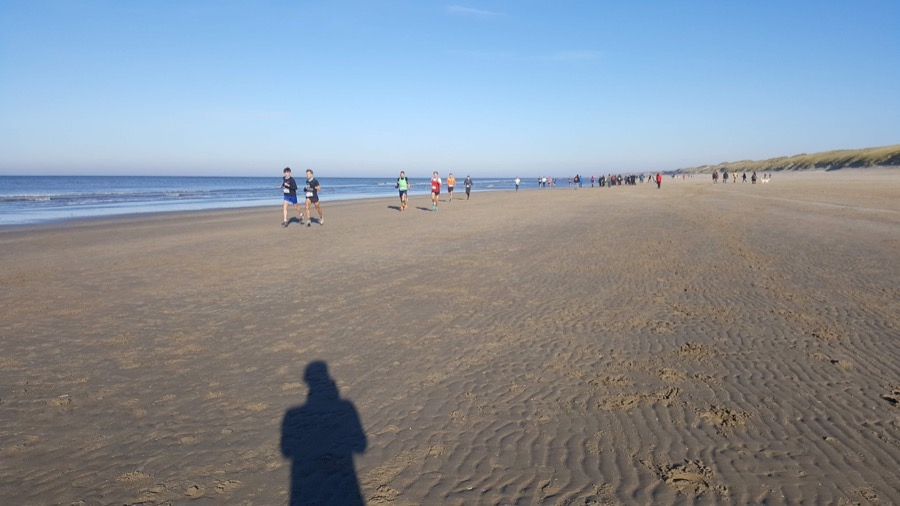
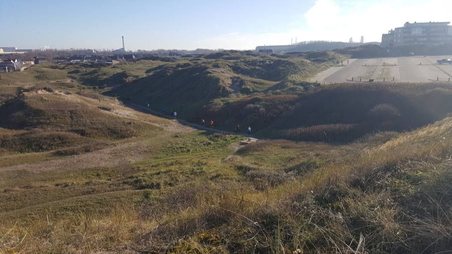
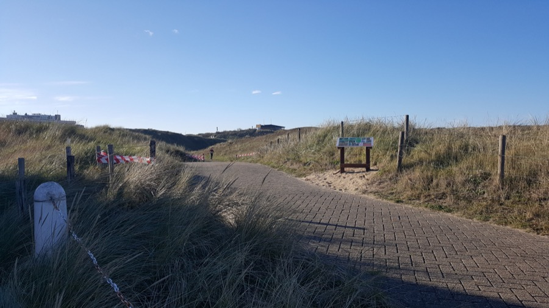
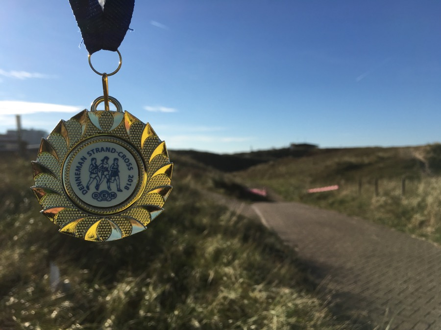

+++
title = "DEM Strand Cross, 18 ноября 2018"
date = "2018-11-19T19:41:00"
tags = ["бег", "фото", "спорт", "истории"]
music = ""
mood = ""
+++

Второй кросс из [серии RunX](523102.md). Как следует из названия особенностью его является пляжная составляющая. Но так как в этом году маршрут изменили, то никто толком не мог сказать, насколько велик будет масштаб страданий.

Подготовка была простая - отдых. Неделю до этого я сделал объем 90+ км, так что в неделю перед стартом решил полностью отдохнуть целых два дня. На утро старта strava показывала fitness/fatigue/form - 30/22/8. По опыту с training peaks значение формы 8 было для меня идеальным.

Точный маршрут я узнал только приехав на место старта - 3 круга по 3.3 км. Общий старт на 3.3 км, 6.6 км и 9.9 км. Решил следовать такой стратегии: первый круг бегу спокойно, присматриваюсь к маршруту, а на остальных кругах если остаются силы - ускоряюсь.

<lj-cut text="Читать дальше...">
Получил номер. Сначала удивился, что не выдали никакого чипа, но потом пошел посмотреть детский старт и оказалось, что тут все по рабоче-крестьянски - ручная запись номеров и ручной замер времени какими-то ручными калькуляторами:

Немного колебался по поводу одежды. Дождя не было, солнечно, но температура всего +6 и довольно сильный ветер, а на пляже наверняка дует еще сильнее. Посмотрел в чем бегут деты - шорты и майки. Ладно, решил в добавок к этому надеть перчатки и армвормеры. Размялся на пару километров, переоделся, встретил коллегу по клубу, размялись еще раз и пошли на старт. На старте знакомые лица - два брата-близнеца, которые практически всегда побеждают на таких небольших стартах, да мужик из нашего клуба, который побеждает вообще всегда в категории masters. Стартанули, побежали. Первые 300 метров "асфальт":

И выбегаем на пляж. Бежим 1100 метров по пляжу против ветра. Часть народа сразу сворачивает к кромке воды, где песок потверже, я бегу с еще несколькими ребятами напрямую, но по более рыхлому песку:

У места разворота два потока сходятся. Не очень понятно, что более выгодно - делать небольшой крюк, но бежать по плотному песку, или же пробежать меньше, но по более рыхлой поверхности. На развороте лежат два невысоких барьера из сена, которые надо перепрыгнуть. Далее 1400 метров по кромке воды в обратном направлении. Ветер уже не встречный, а боковой, так что бежать легче, получается разогнаться:

Выход с пляжа в горку и в конце еще крутой короткий подъем, на котором я даже переходил на шаг чтобы отдышаться. Зато потом 500 метров под горку между дюн:

И на следующий круг:

Бежим второй круг. На пляже снова ломимся напрямую по рыхлому. Бежим с Германом (товарищ по клубу) и еще с парой ребят. Один отрывается и уходит вперед. Догоняем еще одного, какое-то время держимся за ним, потом он отступает - наша очередь вести. Сперва ведет Герман, потом я. Перед разворотом как-то ускоряюсь и ухожу вперед. Становится жарко. Снимаю перчатки и стягиваю немного рукава (заметка на будущее - рукава можно было не надевать). Добегаю второй круг. Остался еще один. Решаю на этот раз бежать ближе к воде. И вроде как лучше, хотя немного мешает встречное движение. На обратном пути стараюсь ускориться, ну или по крайней мере сильно не замедлиться. Финиш.

Время - 42:21. Часы насчитали 10.2 км. Нормально. Особенно порадовал тот факт, что очень ровно получилось разложиться и круги получились ровные и без особых страданий.

В общем зачете 19-й из 136 мужчин и в категории М35 6-й из 34. Второй кросс подряд и опять шестое место в категории. Хотя на этот раз, если честно, наделся попасть в призы в категории, даже на награждение остался. Ан нет - все еще дофига людей бегает намного круче.

Ссылка на [Strava](https://www.strava.com/activities/1972243386).

Еще в этот раз даже медаль выдали:

Следующий кросс через неделю, а следующий отчет о первом кроссе - на днях.

